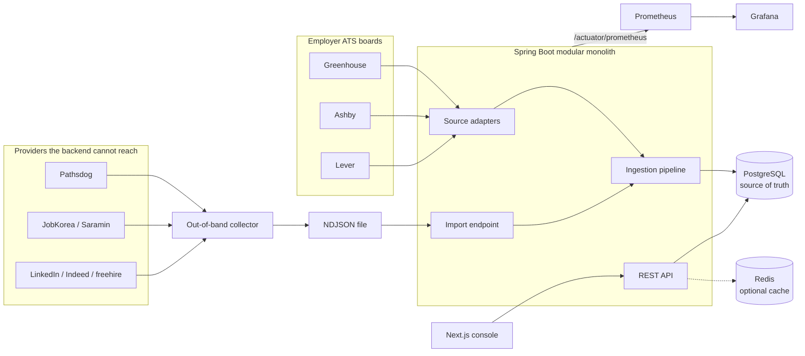
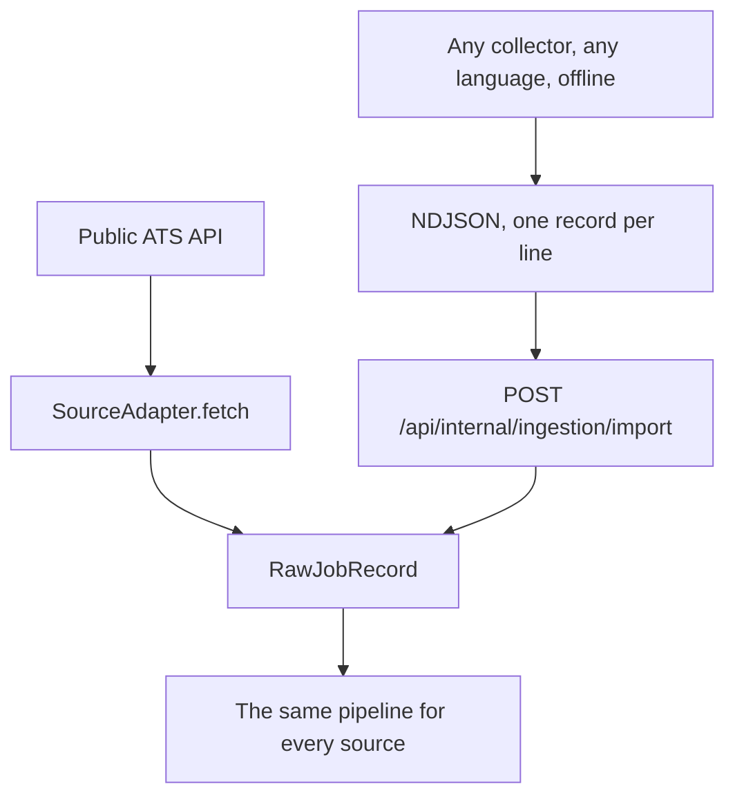
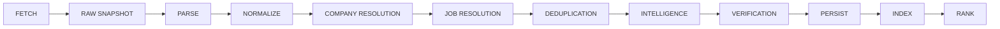
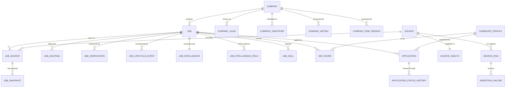
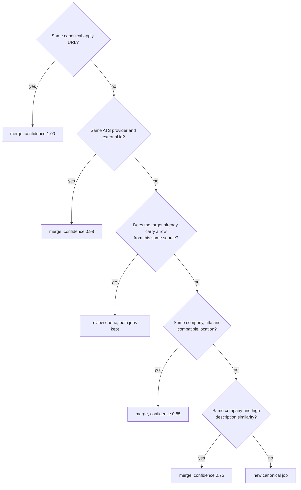
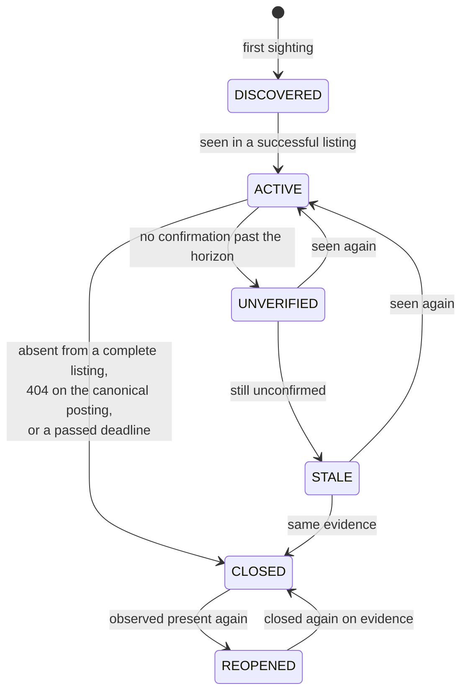
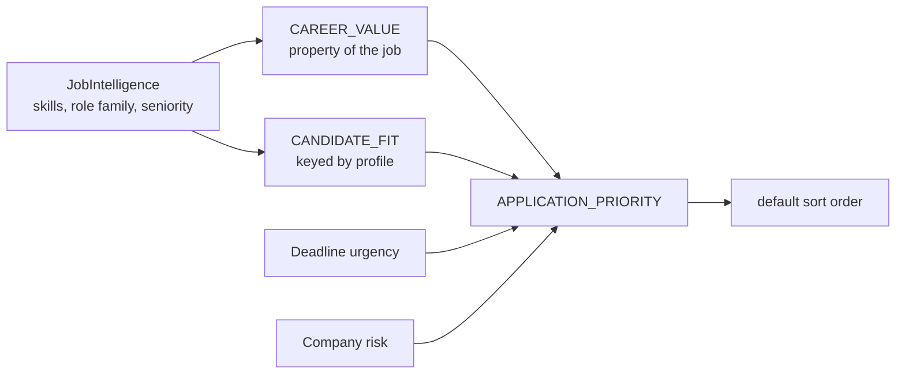

# korea-job-intelligence

A backend platform that discovers South Korean software engineering openings across many
providers, resolves them into canonical jobs, tracks their lifecycle with source-backed
evidence, and ranks them for a specific candidate.

## Table of contents

- [What the system does](#what-the-system-does)
- [Architecture](#architecture)
- [Two source pathways](#two-source-pathways)
- [Ingestion pipeline](#ingestion-pipeline)
- [Domain model](#domain-model)
- [Deduplication](#deduplication)
- [Job lifecycle](#job-lifecycle)
- [Scoring](#scoring)
- [Provenance rules](#provenance-rules)
- [Results from a real run](#results-from-a-real-run)
- [Running it](#running-it)
- [Tracking applications](#tracking-applications)
- [Deploying the console to Vercel](#deploying-the-console-to-vercel)
- [Configuration](#configuration)
- [API](#api)
- [Testing and CI](#testing-and-ci)
- [Repository layout](#repository-layout)
- [Documentation](#documentation)

## What the system does

A single opening is often visible on an employer ATS board, on one or more Korean job boards,
and on international aggregators, each with its own identifier, its own title casing, and its
own idea of what "3 years" means. The platform treats the opening as one canonical `Job` with
many `JobSource` rows behind it, keeps the raw provider payload that every conclusion was
drawn from, and refuses to state anything it cannot trace back to a snapshot.

Capabilities:

- Multi-source aggregation across employer ATS APIs and job boards
- Canonical job resolution and evidence-ranked deduplication
- Lifecycle tracking that distinguishes a closed posting from a failed fetch
- Structured job intelligence with per-field confidence and evidence
- Explainable SWE career-value scoring, kept separate from candidate fit
- Company intelligence with sourced, timestamped metrics
- Application CRM with full status history
- PostgreSQL-backed search, filtering and analytics
- Per-source health, rate-limit state and circuit breaking
- Prometheus metrics, a Grafana dashboard, and run-correlated structured logs

## Architecture

A modular monolith. Java 21, Spring Boot, PostgreSQL as the single source of truth, Redis as
an optional accelerator, Flyway for schema, Gradle for builds, Testcontainers for integration
tests, Next.js for the operator console.



There is deliberately no Kafka, no Kubernetes and no Elasticsearch. PostgreSQL full-text
search plus `pg_trgm` covers the search and fuzzy-matching requirements at this data volume;
the reasoning and the conditions that would change it are in
[ADR 0004](docs/adr/0004-postgres-first-search.md). Module boundaries are Java packages under
`com.kji`, described in [ADR 0001](docs/adr/0001-modular-monolith.md) and enforced by a test.

## Two source pathways

Providers the deployed backend can call are queried in process. Everything else is collected
out of band and crosses a durable boundary as NDJSON. Both pathways build the same
`RawJobRecord`, so nothing downstream can tell them apart, and the runtime never depends on a
collector existing. See [ADR 0003](docs/adr/0003-import-boundary.md).



`sources.runtime_available` records which providers the backend can query for itself. Only
those are eligible for scheduled direct runs; the rest are import-only, and the distinction
is visible in `/api/sources` rather than buried in configuration. It is a statement about
reachability, not about quality.

## Ingestion pipeline



Every run is a `SearchRun` recording source, query, timings, records received and normalized,
new and updated jobs, duplicates, failures and rate-limit events. Each record is ingested in
its own transaction, so a partial record is impossible and a failed one is recoverable:
malformed records are written to `ingestion_failures` with their payload rather than dropped.

## Domain model



| Entity | Responsibility |
| --- | --- |
| `Company` | Employer identity, aliases, per-provider identifiers |
| `Job` | Canonical opening, independent of where it was discovered |
| `JobSource` | One provider's view of a canonical job, with its external id |
| `JobSighting` | Append-only log of every observation of a job on a source |
| `JobSnapshot` | Immutable raw provider payload plus extracted raw fields |
| `JobVerification` | Evidence that a posting was present, absent or unreachable |
| `JobIntelligence` | Structured extraction with per-field confidence and evidence |
| `JobScore` | Career value, candidate fit and application priority |
| `CompanyMetric` | Sourced, timestamped company facts |
| `Application` | Candidate application state and history |
| `SearchRun` | One ingestion run and its counters |
| `SourceHealth` | Per-source reliability, latency and circuit state |

## Deduplication

Merging is destructive in a way that splitting is not. The ladder takes the first rung that
fires and records the rung, the confidence and the evidence on every attachment.



The guard in the middle is the rule that a provider listing two postings is that provider
asserting two postings. Weaker title or description similarity does not overturn it. It was
added after a live run merged six separately numbered `Server Developer` openings from one
Greenhouse board into a single job. Full reasoning in
[ADR 0006](docs/adr/0006-deduplication-ladder.md).

## Job lifecycle

A failed fetch is not a closed posting. Closure requires evidence, and the evidence is stored
and referenced from the job.



A timeout, a connection failure, a 5xx, a 429, an empty response, a parse failure or an open
circuit advances nothing. Absence is only evidence within the listing scope actually fetched,
so a complete run against one ATS board says nothing about another board on the same ATS.
Full reasoning in [ADR 0005](docs/adr/0005-lifecycle-evidence.md).

## Scoring

Three scores, computed and stored separately, because a role can be excellent engineering
experience and still be closed to a new graduate.



Every score row stores `score_version`, `component_scores` as JSON and a human-readable
explanation built from the components that actually moved it. A score without its components
cannot be written. Weights live in a versioned JSON resource, so a reweighting is a version
bump and a recompute. See [ADR 0007](docs/adr/0007-scoring-separation.md).

## Provenance rules

These are enforced in code and covered by tests:

1. Unknown beats an unsupported inference. A field with no evidence stays null.
2. A failed fetch is not a closed posting.
3. `first_seen_at` is never overwritten.
4. Normalized values never overwrite the raw payload they were derived from.
5. Two postings merge only on evidence strong enough to name; every merge stores the method,
   the confidence and the evidence, and can be corrected by hand.

Asking why the system believes something is a join:

```sql
SELECT f.field_name, f.field_value, f.confidence, f.extraction_method,
       f.evidence_text, s.source_url, s.fetched_at, src.code
FROM job_intelligence_fields f
JOIN job_snapshots s ON s.id = f.evidence_snapshot_id
JOIN sources src     ON src.id = s.source_id
WHERE f.job_id = :jobId AND f.field_name = 'years_experience_min';
```

## Results from a real run

From one run against an empty database on 2026-09-03, across nine employer ATS boards on
three ATS platforms and six imported providers:

| | |
| --- | ---: |
| Canonical jobs | 971 |
| Provider rows behind them | 1017 |
| Companies resolved | 80 |
| Raw snapshots | 1017 |
| Jobs corroborated by more than one source | 45 |
| Pairs queued for review | 120 |
| Records discarded | 0 |

500 of the 971 jobs have no seniority bucket and 478 no role family, stored as unknown rather
than guessed. Filtering to what the system is for gives 137 junior-accessible open jobs.

The run exposed three defects that no amount of fixture testing would have found: a complete
listing for one board closing another board's jobs, the deduplication ladder overruling an
employer about its own catalogue, and two spellings of a root path producing two canonical
keys. All three are fixed with regression tests and written up in
[the run log](docs/ingestion-run-2026-09-03.md).

## Running it

No configuration file is required. Every setting has a working default, so the whole stack
comes up with one command:

```bash
docker compose up -d --build
```

The console is on `http://localhost:3000` and the API on `http://localhost:8080`. Every
service declares a healthcheck and `restart: unless-stopped`, and the project is named, so it
appears as a single **korea-job-intelligence** group in Docker Desktop that you can start and
stop from the UI and that comes back after a reboot.

A migrated database holds nothing but the source registry, so every console page opens on an
empty state. Fill it from the collected fixtures in `collected/`:

```bash
printf 'INTERNAL_API_TOKEN=%s\n' "$(openssl rand -hex 32)" > .env
docker compose up -d
node tools/seed.mjs
```

That maps each collected file to import-schema NDJSON and posts it to the import boundary, the
same path a real collector takes, so normalization, deduplication and scoring all run. It
prints what each source contributed:

```
source    received  new  updated  merged  failed  status
--------  --------  ---  -------  ------  ------  ---------
freehire  20        20   0        0       0       SUCCEEDED
indeed    10        10   0        0       0       SUCCEEDED
jobkorea  64        64   0        0       0       SUCCEEDED
linkedin  10        10   0        0       0       SUCCEEDED
pathsdog  30        30   0        0       0       SUCCEEDED
saramin   137       102  0        35      0       SUCCEEDED

236 jobs, 35 merged as duplicates, 0 failures.
```

Re-running it updates rather than duplicates, and `--only pathsdog,saramin` narrows it to
named sources. The internal token is read from `INTERNAL_API_TOKEN` or from a local `.env`.

The one thing worth setting is the internal API token. Ingestion endpoints stay disabled and
answer `401` until you provide one, which is deliberate: the system ships with no usable
credential rather than a predictable default. Create a local `.env` next to the compose file,
which is gitignored and never committed:

```bash
printf 'INTERNAL_API_TOKEN=%s
' "$(openssl rand -hex 32)" > .env
docker compose up -d
```

Add the observability stack when you want it:

```bash
docker compose --profile observability up -d
```

Prometheus lands on `http://localhost:9090` and Grafana on `http://localhost:3001`, with the
datasource and the ingestion dashboard provisioned.

For backend development, run the dependencies in Docker and the application from source:

```bash
docker compose up -d postgres redis
cd backend && ./gradlew bootRun
cd frontend && npm install && npm run dev
node tools/seed.mjs
```

`bootRun` reads `INTERNAL_API_TOKEN` from its own environment rather than from the compose
`.env`, so export the same value in the shell you start it from if you intend to seed.

The Compose project is named, so two checkouts of this repository would fight over the same
Docker Desktop group. If you keep a second copy, give it its own project and ports:

```bash
docker compose -p kji-second up -d
```

## Tracking applications

The console writes, so an application is tracked and moved from the pages that show the work
rather than from a terminal.

**From a posting.** Every job page says whether it is already tracked. If it is not, pick a
starting status, say why it is worth tracking, and the note is recorded against the
application's first transition. If it is, the same control moves it and links through to the
record. Tracking is keyed on the job and the profile and updates in place, so pressing it twice
moves one application rather than creating a second.

**On the record.** `/applications/{id}` is the whole application in one form: status and the
note that explains the change, applied and follow-up dates, resume and cover letter versions,
contact, referral, interview stage and notes. Below it is the status history, every change with
the status it came from. That history is written by the API when the status moves and cannot be
edited from the form, which is the point of keeping it.

**From the list.** `/applications` carries a status control on each row, because triage is
almost always a status change and nothing else. Moving a row sends the status alone and leaves
every other field untouched, and returns to whatever filter the list was showing.

The forms post to server actions and navigate; none of it needs JavaScript in the browser. A
write that the API refuses is reported with what the API said, rather than being swallowed.

Writing needs the shared token. The API guards every write to `/api/applications` the same way
it guards ingestion, and the console sends the token from its own environment, so it stays on
the server and a browser never holds it. Compose passes `INTERNAL_API_TOKEN` to both, so the
`.env` you create for seeding already covers this. A console started without it still shows
everything, says so above each form, and disables the controls rather than letting you fill in
a form that would only be rejected.

## Deploying the console to Vercel

Vercel hosts the Next.js console. It cannot host the Spring Boot API or PostgreSQL, so the
console needs a backend deployed somewhere that speaks HTTP, such as Fly.io, Railway or
Render with a managed PostgreSQL. Without one, the console still builds and serves, and every
page renders a panel saying which URL it tried and what to set. That is by design; it does not
crash.

Project settings:

| Setting | Value |
| --- | --- |
| Root Directory | `frontend` |
| Framework Preset | Next.js, detected automatically |
| Build and Install commands | defaults |
| Environment variable | `BACKEND_URL` = the origin of your deployed API |

`BACKEND_URL` is read at request time by server components, not inlined at build time, so
changing it takes effect on redeploy without a code change. The `output: "standalone"` setting
is applied only when `DOCKER_BUILD=1`, which the Dockerfile sets, so a Vercel build produces a
normal Next.js output.

Before pointing a public console at a real backend, note what is and is not authenticated.
Everything that changes state needs the shared token: the whole internal API, and every write
to `/api/applications`. Reads do not. `/api/jobs` and `/api/companies` are a searchable mirror
of job-board content, but `/api/applications` and `/api/dashboard` also read out the candidate
profile, application statuses, notes and contacts, and anyone who can reach the API can read
those. Deploy it behind access control, or restrict the deployed API to the job and company
endpoints, before it is reachable from the open internet.

Trigger a direct ingestion run against an employer board:

```bash
curl -X POST http://localhost:8080/api/internal/ingestion/run \
  -H "X-Internal-Token: $INTERNAL_API_TOKEN" \
  -H "Content-Type: application/json" \
  -d '{"source":"greenhouse","parameters":{"board":"daangn"},"maxRecords":500}'
```

Import records collected out of band:

```bash
node tools/mcp-export/build-ndjson.mjs collected/pathsdog.json imports/pathsdog.ndjson
curl -X POST "http://localhost:8080/api/internal/ingestion/import?source=pathsdog" \
  -H "X-Internal-Token: $INTERNAL_API_TOKEN" \
  -H "Content-Type: application/x-ndjson" \
  --data-binary @imports/pathsdog.ndjson
```

## Configuration

This table is the reference; there is no committed env file to copy. Anything you override
goes in a local `.env`, which is gitignored. Values in angle brackets are placeholders, not
credentials.

| Variable | Default | Purpose |
| --- | --- | --- |
| `INTERNAL_API_TOKEN` | empty | Required by every `/api/internal/**` endpoint and by every write to `/api/applications`. Empty means ingestion and the CRM are read-only and answer `401`. Set it to `<64-hex-chars-from-openssl-rand-hex-32>`. The console needs the same value: Compose passes it through, and its server actions send it, so it never reaches a browser |
| `POSTGRES_DB`, `POSTGRES_USER` | `kji`, `kji` | Local database name and user |
| `POSTGRES_PASSWORD` | `kji` | Local-only database password. Replace with `<local-postgres-password>` for anything beyond your own machine |
| `CACHE_ENABLED` | `true` | Redis is an accelerator; the system serves correctly without it |
| `INGESTION_SCHEDULER_ENABLED` | `false` | Scheduled direct runs against the targets in `application.yml` |
| `INGESTION_STALE_AFTER` | `P14D` | Staleness horizon for unverified jobs |
| `SOURCE_CIRCUIT_FAILURE_THRESHOLD` | `5` | Consecutive failures before a source's circuit opens |
| `FRONTEND_PORT`, `BACKEND_PORT` | `3000`, `8080` | Published host ports, so the stack fits around whatever you already run |
| `POSTGRES_PORT`, `REDIS_HOST_PORT` | `5432`, `6379` | Published dependency ports |
| `PROMETHEUS_PORT`, `GRAFANA_PORT` | `9090`, `3001` | Published observability ports |
| `GRAFANA_USER`, `GRAFANA_PASSWORD` | `admin`, `admin` | Local Grafana login. Change before exposing it anywhere |

The compose defaults are development conveniences for a stack bound to your own machine. The
read API has no authentication and the database password is a placeholder, so treat this as a
local tool until both are addressed.

Scheduled ingestion targets are declared in `application.yml` under `kji.ingestion.targets`,
so adding a board is configuration rather than code.

## API

| Method | Path | Purpose |
| --- | --- | --- |
| GET | `/api/jobs` | Filtered, sorted canonical job list |
| GET | `/api/jobs/{id}` | Canonical job with sources, intelligence, scores and evidence |
| GET | `/api/companies` | Company list |
| GET | `/api/companies/{id}` | Company with aliases, identifiers, metrics and risk reasons |
| GET | `/api/search` | Same query model as `/api/jobs` |
| GET | `/api/sources` | Source registry with runtime availability and trust tier |
| GET | `/api/sources/health` | Per-source latency, failures, rate limits, circuit state |
| GET | `/api/search-runs` | Ingestion run history |
| GET | `/api/search-runs/{id}` | One run with counters and its recorded failures |
| POST | `/api/internal/ingestion/import` | NDJSON import boundary |
| POST | `/api/internal/ingestion/run` | Trigger a direct-source run |
| GET | `/api/applications` | Application CRM, filtered by `status` or by `jobId` |
| GET | `/api/applications/{id}` | One application with its full status history |
| POST | `/api/applications` | Start tracking a job, or move the application that already tracks it |
| PATCH | `/api/applications/{id}` | Change status and details, recording the transition |
| GET | `/api/dashboard` | Aggregate counters |
| GET | `/actuator/health`, `/actuator/prometheus` | Health and metrics |

Filters on the job list: `keyword`, `company`, `state`, `location`, `source`, `roleFamily`,
`seniority`, `maxYearsExperience`, `minCareerValue`, `minCandidateFit`, `remotePolicy`,
`degreeRequired`, `companyRisk`, `postedWithinDays`, `openOnly`. Sorts: `BEST_MATCH`,
`HIGHEST_CAREER_VALUE`, `JUNIOR_FRIENDLY`, `NEWEST`, `CLOSING_SOON`, `RECENTLY_VERIFIED`,
`MOST_SOURCES`, `COMPANY`.

## Testing and CI

```bash
cd backend  && ./gradlew clean build   # 106 backend tests, plus the coverage floors
cd frontend && npm test                # 75 console tests
cd frontend && npm run lint            # ESLint, flat config
node tools/smoke.mjs                   # the two halves against each other, stack running
cd frontend && npm run test:e2e        # the CRM forms in a browser, stack running
```

**Backend, 106 tests.** Provider adapters run against recorded fixtures, so CI never depends on
a live job site. Everything else runs against real PostgreSQL, in a container started by
Testcontainers. Where there is no Docker, point the suite at a PostgreSQL you already run and
the same 98 tests pass:

```bash
KJI_TEST_DATABASE_URL=jdbc:postgresql://localhost:5432/kji_test ./gradlew test
```

That database is truncated between tests, so give it one kept for testing rather than the one
the application uses.

**Console, 75 tests.** Vitest renders each page as a server component against fixtures captured
from a running backend, so the shapes under test are the real DTOs rather than a guess. The
suite covers the rendered rows, the filters each page sends to the API, the empty states, and
the three ways a page can fail to show content: an unreachable backend, an API error, and a row
that does not exist. The write path is covered at the seam that matters: what body each server
action sends for a given form, how a date input becomes an instant, which statuses are refused
before the API is called, and what the console says when a write is rejected.

**End to end.** `tools/smoke.mjs` drives a running console over HTTP against a running backend
holding seeded rows, and fails if any page comes back empty, broken, or apologising. The unit
suites test each side against a stub and so cannot catch the two drifting apart; this can.

**In a browser.** The CRM forms post to server actions, and a server action only runs when a
browser submits the form Next rendered, so `frontend/e2e` drives the real thing in Chromium:
track a job from its posting, edit the whole record, triage from the list, and check the API
holds what the forms claimed. Point it at a stack that is already up and seeded:

```bash
cd frontend && npx playwright install chromium && npm run test:e2e
```

Where a machine already has a Chromium and cannot download Playwright's own build, set
`PLAYWRIGHT_CHROMIUM_PATH` at that binary.

Coverage is verified in the build, not merely reported: `jacocoTestCoverageVerification` runs
as part of `check` with floors at 75% line and 50% branch against 80.7% and 57.8% measured.

What the suite deliberately covers: normalization of Korean legal-form and experience
variants, deadline sentinels, deduplication including the same-source guard, company
resolution, lifecycle transitions, `first_seen_at` preservation, source-outage behaviour,
closure evidence, reopening, circuit opening, provenance from a claim back to its snapshot,
scoring separation and explanation, cache degradation with Redis absent, and the module
dependency rules.

Three workflows. Backend: build, test, coverage summary, artifacts, image build, then start the
image against a real PostgreSQL to prove it migrates and serves. Frontend: production
dependency audit, typecheck, lint, test, build, image build. End to end: build the whole stack
with Compose, wait for every healthcheck, seed it, run the smoke test, then drive the CRM
forms in Chromium.

## Repository layout

```
backend/     Spring Boot modular monolith
frontend/    Next.js operator console
docs/        Architecture decision records, schema, source coverage, run log
ops/         Prometheus and Grafana configuration
tools/       seed.mjs, smoke.mjs, and the out-of-band collector that emits import NDJSON
collected/   Provider-shaped input for the recorded run, replayable
```

## Documentation

- [ADR 0001 - Modular monolith and module boundaries](docs/adr/0001-modular-monolith.md)
- [ADR 0002 - Canonical job and source sighting model](docs/adr/0002-canonical-job-model.md)
- [ADR 0003 - Durable import boundary for out-of-band collectors](docs/adr/0003-import-boundary.md)
- [ADR 0004 - PostgreSQL-first search and matching](docs/adr/0004-postgres-first-search.md)
- [ADR 0005 - Lifecycle states and closure evidence](docs/adr/0005-lifecycle-evidence.md)
- [ADR 0006 - Deduplication evidence ladder](docs/adr/0006-deduplication-ladder.md)
- [ADR 0007 - Scoring separation and explainability](docs/adr/0007-scoring-separation.md)
- [Source coverage record](docs/source-coverage.md)
- [First full ingestion run, with the defects it exposed](docs/ingestion-run-2026-09-03.md)
- [Database schema](docs/schema.md)
- [Out-of-band collectors and the import boundary](tools/mcp-export/README.md)
